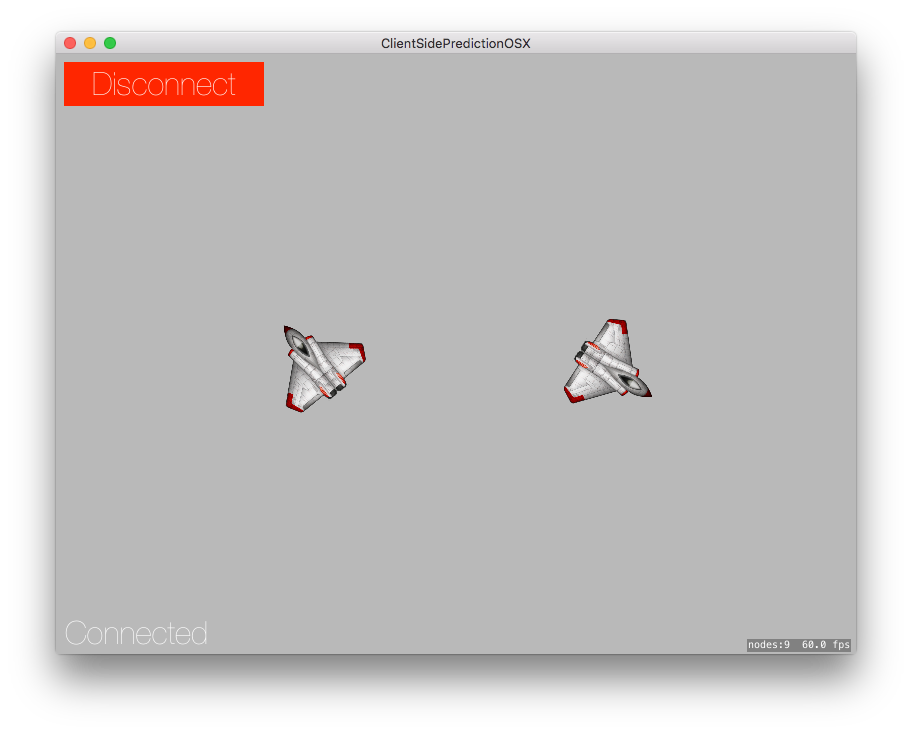

# Swift Client Side Prediction (Peer to Peer)

Simple demo for entity interpolation and client side prediction in a server/client game that is also peer to peer.

Heavily inspired by:
https://developer.valvesoftware.com/wiki/Source_Multiplayer_Networking

* Requires Swift 2.2
* Host as a server or connect to a public ip as a client
* Move with ← → ↑ ↓

# TODOS
* Convert sockets to use UDP (speed/complexity vs reliability)
* Support [NAT-punchthrough](https://keithjohnston.wordpress.com/2014/02/17/nat-punch-through-for-multiplayer-games/)

